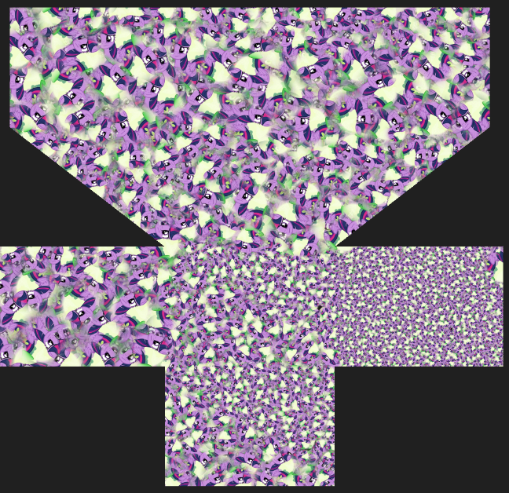

## <b>RIKA IMBANIKA TEXTURER</b>

Should be extremely useful for automatic texturing.

When I done.

Now it can fill texture.

Works with .obj
#
Made on WPF, c#. App builds in Visual Studio.Made on WPF, c#. App builds in Visual Studio.
#

